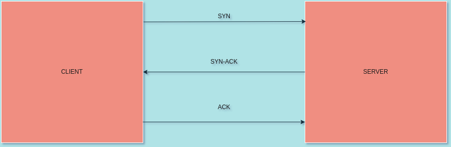

# Java Networking ...

**What is Java Networking?**

Java Networking is a concept of connecting two or more computing
devices together so that we can share resources among different
systems. 

The Advantage of using Java networking is that not only you get to
share the resources but you can also centralize the software for management.

**What does Java socket programming provide?**

Java Socket programming provides the facility to share data between
different computing devices. 

## Java Networking Terminologies: 

Here are some networking terms you should know before you get started
in Java Networking:

1. IP Address.
1. Protocol.
1. Port Number.
1. MAC Address.
1. Connection-Oriented and Connection-less Protocol. 
1. Socket. 

1. **What is an IP Address?**

An IP Address is a 32-bit unique address which is assigned to each node in a network. It is expressed in terms of
octets that range from 0 to 255. The address is a logical address therefore it can be changed or modified. 

**For Example:** `192.168.1.1`. 

2. **What are protocols?**

A protocol is a set of rules which are followed to create a
communication channel. Here are some of the protocols which we use in the industry: 

* **FTP.**
* **POP.**
* **SMTP.**
* **TCP.**
* **TELNET.**
* **UDP.**

3. **What is a PORT Number?**

A port number is used to unique identifying number which acts as a communication endpoint between different
applications. Port numbers are associated with an IP Address for communication between two applications. 

**For Example:** `127.0.0.1:8080`

4. **What is a MAC Address?**

**MAC** (Media Access Control) address is a unique identifier
of **NIC** (Network Interface Controller). A network node can
have multiple **NIC** but each with unique MAC address.

**For Example:** `00:0d:83::b1:c0:8e`

5. **Difference Between Connection-Oriented and Connection-Less
	 Protocol**
	 
* **Connection Oriented Protocol:** 
In connection-oriented protocol, acknowledgement is sent
by the receiver. So it is reliable but slow. 

**For Example:** TCP which uses Three way handshake. 

* **Connection Less Protocol:**
In connection-less protocol, acknowledgement is not
sent by the receiver. So it is not reliable but fast. 

**For Example:** UDP is a connection-less protocol. 

## Protocols: 

**What are protocols?**

Protocols are set of rules used to establish a communication medium between different devices.

The `java.net` package supports two protocols:

* **TCP:** TCP stands for transmission control protocol which is a
	connection-oriented protocol. TCP provides us a very reliable
	connection between the sender & the receiver. TCP is used
	along with the Internet Protocol and is referred as TCP/IP. 

* **UDP:** UDP stands for user datagram protocol which is a
	connection-less protocol. In UDP, the packets of data are allowed
	are transferred along with the help of two or more nodes. 

